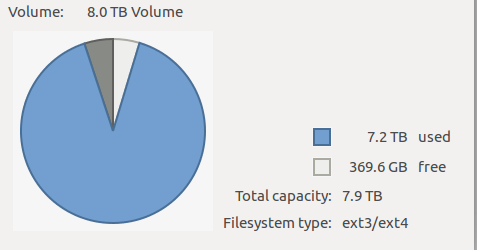

本文分为2部分：

- 第一部分介绍动机
- 第二部分详细介绍具体的步骤
- 第三部分是其他一些有用的命令

## 一、动机


随着工作年限的增长，工作和生活中积累的资源越来越多，尤其收藏的电影、数据集最为占硬盘。以物体跟踪数据集为例，整个TAO数据压缩包就有241.6GB。


<center>图：8T硬盘使用情况</center>

以往的方式是挤牙膏式的趁着活动一块一块买，数据一点一点的腾挪。今年以来硬盘持续降价，以我关注的8T硬盘为例，从1200降到了1000。

所以才产生了将多块硬盘映射为一块的方法。这降省去了大量的硬盘管理和数据腾挪的时间。

## 二、具体的步骤

首先是看看系统挂载了几块盘，执行命令```sudo fdisk -l```，输出的信息节选如下:

```
Disk /dev/sdd: 7.3 TiB, 8001563222016 bytes, 15628053168 sectors
Units: sectors of 1 * 512 = 512 bytes
Sector size (logical/physical): 512 bytes / 4096 bytes
I/O size (minimum/optimal): 4096 bytes / 4096 bytes
```

接着是为新盘创建新分区。

假设```/dev/sdd/```为新的硬盘，那么执行```sudo fdisk /dev/sdd/```，可以看到输出：
```
Command (m for help):
```

这样就进入硬盘编辑模式了。

- 输入d是删除分区(新盘可以不执行)，这里需要注意将原来的数据在别的磁盘进行全部备份。
- 输入n是新建分区；
- 输入t设置新分区的格式
- 输入p是列举硬盘的所有分区;
- 输入w是保存之前的修改。

所以完成的操作就是(省去了d操作)：
```
$ sudo fdisk /dev/sdd

Welcome to fdisk (util-linux 2.27.1).
Changes will remain in memory only, until you decide to write them.
Be careful before using the write command.

Command (m for help): n
Partition number (1-128, default 1): 1
First sector (34-468862094, default 2048): 
Last sector, +sectors or +size{K,M,G,T,P} (2048-468862094, default 468862094): 

Created a new partition 1 of type 'Linux filesystem' and of size 223.6 GiB.

Command (m for help): t
Hex code (type L to list all codes): 30
Changed type of partition 'Linux filesystem' to 'Linux LVM'.

Command (m for help): w
The partition table has been altered.
Calling ioctl() to re-read partition table.
Syncing disks.

```

接着安装LVM2和加载LVM2模块：
```
$ sudo apt-get install lvm2
Reading package lists... Done
Building dependency tree       
Reading state information... Done
lvm2 is already the newest version (2.02.133-1ubuntu10).
lvm2 set to manually installed.
0 upgraded, 0 newly installed, 0 to remove and 38 not upgraded.
$ modprobe dm-mod
```

再执行```sudo fdisk -l ```，可以看到:
```
Disk /dev/sdd: 223.6 GiB, 240057409536 bytes, 468862128 sectors
Units: sectors of 1 * 512 = 512 bytes
Sector size (logical/physical): 512 bytes / 512 bytes
I/O size (minimum/optimal): 512 bytes / 512 bytes
Disklabel type: gpt
Disk identifier: 571F1D75-FB94-4279-A090-0C96F9AA89B7

Device     Start       End   Sectors   Size Type
/dev/sdd1   2048 468862094 468860047 223.6G Linux LVM

```

出现了```/dev/sdd1```的新分区。

以上完成了准备工作，下面就是创建lvm分区了：

- 创建物理盘：

```
$ sudo pvcreate /dev/sdd1
WARNING: vfat signature detected on /dev/sdd1 at offset 82. Wipe it? [y/n]: y
  Wiping vfat signature on /dev/sdd1.
WARNING: vfat signature detected on /dev/sdd1 at offset 510. Wipe it? [y/n]: y
  Wiping vfat signature on /dev/sdd1.
  Physical volume "/dev/sdd1" successfully created
```

- 创建分组和逻辑盘
```
$ sudo vgcreate media /dev/sdd1
  Volume group "media" successfully created

$ sudo lvcreate -l100%FREE -ndisks media
  Logical volume "disks" created.
```

- 改变逻辑盘格式
```
$ sudo mke2fs -t ext4 /dev/media/disks
mke2fs 1.42.13 (17-May-2015)
Discarding device blocks: done                            
Creating filesystem with 58606592 4k blocks and 14655488 inodes
Filesystem UUID: 6d2517f0-d5eb-4bf9-955c-cce175b03e9e
Superblock backups stored on blocks: 
	32768, 98304, 163840, 229376, 294912, 819200, 884736, 1605632, 2654208, 
	4096000, 7962624, 11239424, 20480000, 23887872

Allocating group tables: done                            
Writing inode tables: done                            
Creating journal (32768 blocks): done
Writing superblocks and filesystem accounting information: done
```

- 挂载

```
$ mkdir ~/disks

sudo mount /dev/media/disks ~/disks/
sudo umount /dev/media/disks #取消挂载

$ sudo vim /etc/fstab
#这一步是一劳永逸的方式，直接在系统进行<磁盘，目录>映射
/dev/media/disks ~/disks/ ext4 defaults 0 1
```


## 三、其他

```
sudo vgextend media /dev/sdb1
```
将/dev/sdb1分配给media组。

```
sudo lvextend -L+150G /dev/media/disks
sudo resize2fs /dev/media/disks
```
额外分配150G给/dev/media/disks，并更新


```
sudo vgdisplay
```
显示当前的分区情况。比较重要的是：
```
  Alloc PE / Size       431253 / 1.65 TiB
  Free  PE / Size       478 / 1.87 GiB
```
这里可以关注的是还有多少空余空间。


